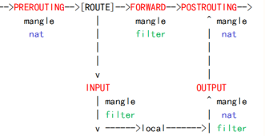

# tables -> chains -> rules

# 数据处理顺序 链 chains 包含规则 rules
PREROUTING(修改地址)  INPUT  OUTPUT  POSTROUTING
## 入站
PREROUTING -> INPUT
## 转发
PREROUTING -> FORWARD -> POSTROUTING
## 出站
OUTPUT -> POSTROUTING

# tables (优先顺序)
raw
    PREROUTING POSTROUTING
mangle (用于修改)
    PREROUTING  INPUT  FORWARD OUTPUT  POSTROUTING
nat
    PREROUTING OUTPUT POSTROUTING
filter  (default table, only accept, drop)
    INPUT FORWARD OUTPUT

# 处理动作
ACCEPT REJECT DROP REDIRECT MASQUERADE LOG ULOG DNAT SNAT MIRROR QUEUE RETURN TOS TTL MARK

# cmd
iptables -Lv INPUT

